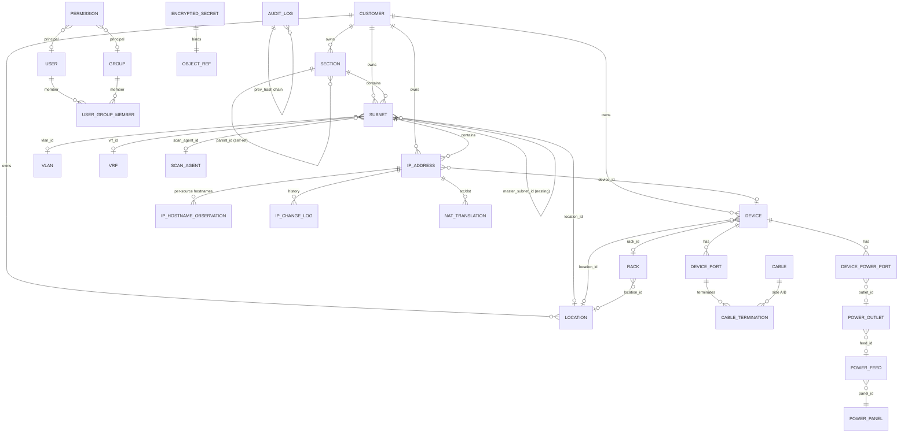

# jt-ipam のコアデータモデル

> English: [DATA_MODEL.md](DATA_MODEL.md) · 繁體中文版：[DATA_MODEL_zh-TW.md](DATA_MODEL_zh-TW.md)

> バックエンド：SQLAlchemy 2.0（async）+ PostgreSQL 16 + Alembic。`inet` / `cidr` / `macaddr` / `citext` / `jsonb` といったネイティブ型を使います。主キーは原則 UUID です（件数が多いもの、連鎖するログのテーブルのみ `bigint`）。
>
> この文書は**現在の**モデルを追っています。`backend/app/models/` の ORM から起こしたもので、マイグレーションは `backend/alembic/versions/` にあります。エンティティごとに、意味のある関連と外部キーを中心に記述しており、すべての列を列挙してはいません。

---

## 1. ER 図（コア）



---

## 2. IPAM のコア

### 2.1 `customers` — 管理組織／テナント
顧客（管理組織）は jt-ipam における所有の起点です。phpIPAM がセクションとサブネットだけを扱うのに対し、jt-ipam では**セクション・サブネット・IP アドレス・機器・拠点・仮想化クラスタ・VLAN** に `customer_id` の外部キーが付きます。顧客による絞り込みは IP の関連付けの連鎖にも効きます（たとえば同じ顧客の VM にしか IP を紐づけない、など）。

- `name`（一意のスラッグ）、`title`（表示名）、`description`、`contact`、`email`、`phone`、`address`。

### 2.2 `sections`
最上位のグループです。入れ子にするための自己参照 `parent_id`（SET NULL）、`strict_mode`、`display_order`、任意の `customer_id` を持ちます。

### 2.3 `subnets`
- `section_id`（CASCADE、必須）、`master_subnet_id`（自己参照の入れ子）、`cidr`（ネイティブの `cidr`）。
- `vlan_id`、`vrf_id`、`location_id`、`customer_id`、`gateway`（`inet`）、`dns_servers`（カンマ区切り）。
- `is_pool`、`is_full`、`threshold_pct`（使用率の警告）、`auto_dns`。
- `archived_at` — 非 NULL はアーカイブ済みを意味します。データは保持したまま非表示になり、スキャンもされず、重複チェックの対象からも外れます（配下の IP も併せて非表示になります）。
- **スキャン**：`scan_enabled`、`scan_method`（`text[]`、既定は `{icmp}`）、`scan_agent_id`（FK → scan_agents。設定されていれば、ローカルホストではなくそのエージェント経由でスキャンします）。
- `custom_fields`（jsonb）。`cidr` には GiST の索引があります。

### 2.4 `ip_addresses`
- `subnet_id`（CASCADE）、`ip`（`inet`）、`(subnet_id, ip)` に一意制約、`ip` に GiST の索引。
- `hostname`（解決済みの実効値）、`description`、`owner`、`note`、`state`（`active`／`reserved`／`offline`／`dhcp`／`used`）、`customer_id`、`device_id`。
- **MAC とスイッチ上の位置**：`mac`（`macaddr`）、`mac_source`（どのソース由来か。ARP の優先順位に使います）、`switch_port`、`switch_port_confident`（FDB から導出。複数の MAC を抱えるアップリンクやトランクのポートでは false）。
- **探査とスキャン**：`exclude_from_ping`、`excluded_probes`（`text[]`。IP 単位で除外する探査。icmp は `exclude_from_ping` と同期します）、`probe_last_run`（jsonb の `{probe: timestamp}`。「次はいつ」の表示に使います）。
- **OS の推定**：`os_guess`（生の文字列）、`os_family`（アイコン対応づけ用に正規化した鍵。`core/os_fingerprint.py` を参照）。
- **ホスト名の優先順位**：`hostname_source_pin` —— 実効ホスト名を特定のソースに固定します（NULL なら全体の優先順位に従います）。ソースごとの生のホスト名は `ip_hostname_observations` にあります。
- **複数ソースの死活**：`discovery_source`（`manual`／`scanner`／`librenms`／`dns`／`proxmox`／`opnsense`／`phpipam`）、`last_seen_scanner`、`last_seen_librenms`、`last_seen_dns`、`effective_status`（小文字。`online`／`online (scanner)`／`online (librenms)`／`offline` など）。
- `in_dhcp_lease`（ファイアウォールの DHCP リースから自動的に付きます）、`ptr_ignore`、`custom_fields`（jsonb）。

### 2.5 `ip_hostname_observations`
`(ip, source)` ごとに 1 行で、そのソースが報告したホスト名を保持します。`IPAddress.hostname` は、全体の優先順位と IP 単位の固定からこれらを解決した値です（解決処理は `services/hostname.py`）。ソースは manual / scanner / librenms / dns / proxmox / opnsense / wazuh / adguard です。

### 2.6 `ip_change_log`
IP のあらゆる変更の高頻度な履歴です（created / deleted / hostname_changed / mac_changed / state_changed / online / offline / arp_changed / edited）。**あえて**監査の SHA-256 チェーンには含めていません（同期由来のオンライン／オフラインや ARP のイベントは頻度が高すぎて、チェーンに直列化できません）。`ip_text` と `subnet_id` のスナップショットを持つので、IP が削除されても履歴は残ります（外部キーは SET NULL）。索引は `(ip_id, created_at)`。

### 2.7 `nat_translations`
phpIPAM の特徴である NAT を、OPNsense のポート転送ルールを写せるよう拡張したものです。
- `type`（`one_to_one`／`many_to_one`／`port_forward`）、`src_ip_id` / `dst_ip_id`（FK ip_addresses）、`src_port` / `dst_port`（範囲用に `_to` も）、`protocol`、`src_interface`、`device_id`。
- OPNsense との対応：`disabled`、`no_rdr`、`ip_version`、`src_not` / `dst_not`、`log`、`category`、`nat_reflection`、`pool_options`、`filter_rule`、そしてエイリアスの参照（`src_alias` / `dst_alias` / `src_port_alias` / `dst_port_alias` / `redirect_alias`）。
- 同期の出どころ：`source_origin`（`manual` / `phpipam` / `opnsense:<fw_uuid>` / `pfsense:<fw_uuid>`）と `external_id`（この組み合わせが upsert の鍵です）。

### 2.8 `ip_requests` / `ip_request_events`
IP 申請のワークフローで、状態機械は明確です（`pending → approved → fulfilled` ／ `rejected` ／ `cancelled`）。`ip_request_events` は時系列（状態変化ごとに 1 行）です。承認時に IP をアトミックに確保します（`allocated_ip_id`）。

---

## 3. スキャンエージェントと探査のモデル

### 3.1 `scan_agents`
複数拠点からのスキャンです。エージェントは対象セグメント内に配置します（中央のホストから他セグメントをスキャンしようとしてもファイアウォールに阻まれます）。現在のモデルは**プッシュ**型で、エージェント側からサーバーへ接続します。
- `name`、`description`、`enabled`、`agent_url`（旧来のプル型。任意）。
- 認証：プッシュ型は `enroll_key_hash`（作成時に一度だけ表示する登録キーの sha256）、旧来のプル型は `api_token_enc` / `api_token_nonce`（AES-GCM）。
- 稼働情報：`last_seen_at`、`last_error`、`agent_version`、`last_source_ip`。
- **探査の設定**：`enabled_probes`（`text[]`。実行できる上限。既定は `{icmp}`）、`probe_intervals`（jsonb の `{probe: 秒}` による上書き）、`available_probes`（`text[]`。エージェントが実際に実行可能と報告してきたもの。UI のグレーアウトに使います）、`force_scan_at`（管理者の「今すぐ実行」。エージェントは次回のポーリングで拾い、その後クリアされ、その周期のすべての探査が対象になります）。

### 3.2 三層による探査の解決
ある IP に対して実際に実行される探査は次のとおりです。

```
agent.enabled_probes  ∩  subnet.scan_method  −  ip.excluded_probes
```

つまり、エージェントの能力の上限と、サブネットで選んだ方法の共通部分から、IP 単位の除外を引いたものです。探査の一覧と既定値は `app/core/scan_probes.py` にあります。

---

## 4. 機器と物理層

### 4.1 `devices`
- `name`、`fqdn`、`primary_ip_id`（FK ip_addresses、use_alter）、`type`（`server`／`switch`／`router`／`firewall`／`ap`／`storage`／`ipmi`／`other`）、`vendor`、`model`、`serial`、`customer_id`、`custom_fields`。
- ラックへの設置：`location_id`、`rack_id`、`u_position`、`u_size`、`rack_face`（`front`／`rear`）、`rack_side`（`full`／`left`／`right` —— ハーフ U の機器は 1 つの U を分け合います）。

### 4.2 `locations`（＝データセンター／部屋）と `racks`
- **Location**：`name`（一意）、`address`、`latitude` / `longitude`、`customer_id`、`floor_plan_path`（アップロードしたフロアプランの下図。拠点はそのまま「部屋」としても扱えます）。
- **Rack**：`location_id`、`name`、`u_height`（既定 42）、物理寸法の `width_mm` / `depth_mm`（フロアプラン上で実寸に合わせるため）、`seq`（左右の並び順）、`numbering`（`top-down`／`bottom-up`）、`face`（`front`／`rear`）、フロアプラン上の配置 `pos_x` / `pos_y`（0〜1 の比率）、`pos_rot`（任意の角度）、`pos_w` / `pos_h`。

### 4.3 配線 — `device_ports`、`cables`、`cable_terminations`
NetBox に近い構成ですが、より簡潔です（種別ごとにテーブルを分けず、多態的な終端テーブル 1 つにまとめています）。
- **DevicePort**：機器上のポートやインタフェース。`type`（`network`／`front`／`rear`／`console`／`power`）、`peer_port_id`（前面↔背面の貫通。パッチパネルを辿るために使います）、`position`、`mac_address`（そのポート自身の物理 MAC。たとえば LibreNMS の `ifPhysAddress` であり、学習した対向の MAC ではありません）。`(device_id, name)` に一意制約。
- **Cable**：`label`、`type`（`cat6`／`fiber-mm`／`fiber-sm`／`power`）、`color`、`length_m`、`status`（`planned`／`connected`／`decommissioned`）。
- **CableTermination**：ケーブルの両端。`side`（`A`／`B`）、多態的な `(object_type, object_id)`（機器／パッチパネルのポート／コンセントなど）、`port_label`。ケーブル追跡はこれらと、ポートの `peer_port_id` による貫通を辿ってマルチホップで経路を描きます。

### 4.4 電源 — NetBox 方式
- **PowerPanel** → **PowerFeed**（`voltage_v`、`amperage_a`、`phase` は単相／三相、`supply_type` は ac／dc、任意の `rack_id`）→ **PowerOutlet**（`feed_id`、`rack_id`、`label`）。
- **DevicePowerPort**：機器側の電源入力（PSU1 / PSU2 など）。`outlet_id`（FK power_outlets。NULL は未接続）、`max_watts`。1 台に複数持たせられるので、A 系統 / B 系統にまたがる二重化を表現できます。

---

## 5. 全体に関わる基盤（拡張リソース）

これらは全体で共有される基盤データです（オブジェクト単位の権限はありません）。UI での露出は `require_global_read` で制御します。いずれも CRUD / PATCH に対応します。

- **`vlan_domains` / `vlans`**：VLAN の `number`（1〜4094、ドメイン内で一意）、`name`、任意の `customer_id` / `section_id`。**`device_vlans`** は `librenms_devices ↔ vlans` を結びます（取得のみ。LibreNMS の同期が書き込みます。あえて jt-ipam の Device ではなく LibreNMS の機器を鍵にしています）。
- **`vrfs`**：`name`（一意）、`rd`（Route Distinguisher）、`allow_overlap`。
- **`asns`**：`asn`（bigint、一意）、`rir`、任意の `tenant_id`。
- **組織**：`tenant_groups`（自己参照）→ `tenants`（`slug`、`group_id`）。
- **回線**：`providers` → `circuits`（事業者ごとに一意の `cid`、`type_id` → `circuit_types`、`status`、日付、`monthly_fee_cents`、`commit_rate_kbps`、非対称の `up_kbps` / `down_kbps`、任意の固定 IP の項目 `ip_address` / `gateway` / `netmask` / `dns_servers`、WAN 側の機器を指す `device_id`、`tenant_id`）。
- **連絡先**：`contact_groups`（自己参照）、`contact_roles`、`contacts`、そして `contact_assignments`（多態的な `(object_type, object_id)` により、任意のオブジェクトへ連絡先と役割を割り当てます）。
- **無線**：`wireless_ssids`（`ssid`、`auth_type`、`vlan_id`、`tenant_id`）、`wireless_links`（A/B の機器による 1 対 1 のリンク）。
- **VPN**：`vpn_tunnels` —— `type`（ipsec_ikev1 / ikev2 / wireguard / openvpn / l2tp / vxlan / vpls / evpn / other）、A/B の機器とエンドポイント、確実な対応付けのための WireGuard の `local_public_key` / `peer_public_key`、そして UI に確からしさを示す `pairing_method`（`wireguard_pubkey` は確実、`ipsec_endpoint` は推定）。

---

## 6. 連携

どの連携にも、**インスタンス**のテーブル（接続情報。API キーやパスワードは AES-GCM で暗号化し、多くは `*_enc` / `*_nonce` の 2 列、または `encrypted_secrets` に保管します）と、**同期先**のテーブル（取得のみのキャッシュ）があります。

### 6.1 LibreNMS — `librenms.py`
- **LibreNMSInstance**：`api_url`、暗号化されたトークン、機能ごとの切り替え（`sync_devices` / `sync_arp` / `sync_fdb` / `sync_vlans` / `use_for_status` / `auto_add_devices` / `auto_create_ips`）、`scope_subnet_ids`（jsonb。IP の解決を特定のサブネットに限定し、重複したセグメントを区別します）、間隔と last_sync / error。`auto_create_ips`（既定は有効）は、監視対象の機器の主 IP が範囲内の既存サブネットに入るとき、`ip_addresses` の行を作成します。
- **LibreNMSDevice**：取得した機器（`legacy_device_id` が LibreNMS の id）、`hostname` / `sysname` / `primary_ip` / `hardware` / `os` / `status`、`jt_ipam_device_id` による紐づけ。
- **ARPEntry**：`/resources/ip/arp/` から得た IP↔MAC。`interface` / `vrf` を伴い、IP の MAC を補完するのに使います。
- **FDBEntry**：`/devices/{id}/fdb` から得た MAC の位置（`port_name`、`vlan_id_num`）。スイッチポートの導出に使います。

### 6.2 Wazuh — `wazuh.py`
- **WazuhInstance**：`api_url`、`api_user` と暗号化されたパスワード、`verify_tls`。
- **WazuhAgent**：同期ごとのエージェント（`agent_id`、`ip`、`status`、OS とバージョン、`group`、keep-alive）。`jt_ipam_address_id` で IP と紐づきます。`cve_summary_at` は残っていますが、CVE の件数を持つ 2 列は `0138` で削除しました —— 書き込む処理が一度も存在しなかったからです。Wazuh 4.8 以降 manager API に脆弱性のエンドポイントは無く、常に null の列は「調べたが何も無かった」と読めてしまい、「一度も調べていない」という事実を覆い隠します。

### 6.3 OPNsense ファイアウォール — `firewall.py`、`firewall_rule.py`、`nat.py`、`dhcp.py`
- **OPNsenseFirewall**：暗号化された `api_key` と `api_secret`、`verify_tls`、同期の切り替え（`sync_dhcp` / `sync_arp` / `sync_openvpn` / `sync_rules` / `sync_nat` / `sync_aliases`）、そして `expose_dsv`（任意。このファイアウォールのルールラベル→エイリアスと、エイリアス→メンバーの対照表を Graylog の DSV として公開します）。
- **OPNsenseAliasMapping**：jt-ipam の範囲を OPNsense のエイリアスへ反映する規則。`selector`（jsonb。section / subnet / tag / custom_field）、`direction`（push / pull / both）、直近の同期状態。
- **OPNsenseSyncedAlias**：閲覧用に OPNsense から取得したエイリアス（`content`、`member_count`）。エイリアス→メンバーの Graylog DSV の元にもなります。
- **OPNsenseRuleLabel**：`pf_statistics` から解析したもので、filterlog の `rid`（pf のルールラベル）を、そのルールが参照するエイリアスへ対応づけます（`label`、`action`、`interface`、`alias_names` jsonb）。ルール→エイリアスの Graylog DSV に供給され、ログイベントを `rid` から補完できます。
- **OPNsenseRule**：ファイアウォールのルールを読み取り専用のキャッシュとして取得します（`legacy_uuid`、action / interface / direction / protocol、送信元と宛先のネットワークとポート、`raw` jsonb）。
- **DHCPPoolRange**：ファイアウォール（Kea / ISC）から同期した DHCP のプール範囲 —— `subnet_cidr`、`start_ip` / `end_ip`。範囲に入る IP には DHCP の印が付きます。

> **Graylog DSV**（`/api/v1/lookup/...` 配下の、トークンで保護されたルックアップ用エンドポイント）：全体の IP→ホスト名 / FQDN の表、ファイアウォールごとの `rid → エイリアス` と `エイリアス → メンバー`（`expose_dsv` で制御）、クラスタごとの Proxmox `vmid → VM 名`。Graylog の「DSV File from HTTP」データアダプタから利用します（キー列 0、値列 1）。

### 6.3b pfSense ファイアウォール — `pfsense.py`（OPNsense とは別の専用設定ページ）

サードパーティの **pfSense-pkg-RESTAPI**（pfrest.org。ベースは `/api/v2`、`X-API-Key`）経由で pfSense と通信します。

- **PfSenseFirewall**：暗号化された `api_key`、`verify_tls`、同期の切り替え（`sync_dhcp` / `sync_arp` / `sync_aliases` / `sync_rules`）、`expose_dsv`、そして簡潔な `rules`（jsonb）のキャッシュ。`scope_subnet_ids` で範囲を絞れます。
- **PfSenseSyncedAlias**：閲覧用に取得したエイリアス（`members`、`alias_type`）。エイリアス→メンバーの Graylog DSV にも供給します。
- pfSense の NAT ポート転送は、`source_origin = pfsense:<fw_uuid>` として同じ `nat_translations` テーブルへ同期されるため、OPNsense の NAT と並べて一覧でき、ソースで絞り込めます。

### 6.4 Proxmox の仮想化 — `virt.py`
- **ProxmoxInstance**：PVE の API 接続（ノードのフェイルオーバー用の `api_url` と `extra_api_urls`、`auth_username` / `auth_token_id`、秘密は `encrypted_secrets` 経由、`verify_tls`）。
- **VirtCluster**：Proxmox のクラスタ（`type`、`is_standalone`、`location_id`、`tenant_id`、`customer_id`）。
- **VirtualMachine**：VM / CT（`legacy_vmid`、`node`、`kind` は vm / ct、`status`、vcpus / memory / disk）、`primary_ip_id`、`device_id` による紐づけ、`is_template`。
- **VMInterface**：`mac`、`primary_ip`、`bridge`、`vlan_id`。

### 6.5 DNS — `dns.py`
- **DNSServer**：提供元の抽象化である `type`（powerdns / bind9 / unbound_opnsense / windows_dns / univention_ucs）。資格情報は `encrypted_secrets` にあります。
- **DNSZone**：`type`（forward / reverse）、`managed`、`associated_subnet_ids`（`uuid[]`）。
- **DNSRecord**：`type`（A / AAAA / PTR / CNAME / MX / TXT / SRV / NS / SOA）、`source`（manual / from_ipam / from_dns_pulled）、ずれの報告に使う `consistency_state`（consistent / dns_only / ipam_only / mismatch）、任意の `ipam_address_id` による逆参照。

### 6.6 AdGuard Home — `adguard.py`
- **AdGuardInstance**：HTTP Basic 認証（暗号化されたパスワード）、`sync_clients` / `sync_rewrites` の切り替え。IPAM のデータを補完する取得専用の連携です。

### 6.7 phpIPAM からの移行 — `migration_mapping.py`
- **PhpIPAMMigrationMapping**：`(object_type, legacy_id)` → `jt_ipam_id`。再実行を冪等にし変更を検出するための `last_synced_hash`（正規化 JSON の sha256）と、削除の検出に使う `last_seen_at` を持ちます。

### 6.8 OUI — `oui.py`
- **OUIVendor**：IEEE の MAC ベンダー検索。主キーは 16 進 6 桁の `prefix`（先頭 24 ビット）、`short_name` / `name`、`source`（Wireshark の `manuf`。毎月更新）。

---

## 7. AI / LLM

- **`ai_chat_conversations`**（利用者ごと。`title` は最初の質問から）→ **`ai_chat_messages`**（`role` は user / assistant、`content`、`model`、`elapsed_ms`。`created_at` は `clock_timestamp()` を使うので、同一ターンの user→assistant の順序が保たれます）。保存するのは最終的な質問と回答だけで、ツールの実行過程は残しません（内部データを含むためです）。保持期間は `system_settings.ai_chat.retention_days` で管理者が設定します。

---

## 8. セキュリティ、RBAC、システム

### 8.1 `users` / `groups` / `user_group_members`
- **User**：`username` / `email`（citext で一意）、`password_hash`（argon2id。外部認証では NULL）、`auth_provider`（local / ldap / radius / saml / oidc）、`external_subject`、`is_active`、`is_admin`、暗号化された TOTP（`totp_secret_enc` / `totp_nonce`）、ロックアウト（`failed_login_count` / `locked_until`）、`last_login_at` / `last_login_ip`。CHECK：ローカルの利用者にはパスワードが必須です。
- **Group**：`name`（citext で一意）、`is_builtin`。所属は `user_group_members`（複合主キー）で表します。

### 8.2 `permissions` — オブジェクト単位の RBAC（既定は拒否、A01）
オブジェクト単位の権限：`(object_type, object_id, principal_type, principal_id, level)`。
- `object_type` は `customer / section / subnet / ip / device / rack / location` の 7 種類（付与できる対象）。
- `object_id` が NULL ならワイルドカード（その種別のすべて）。
- `principal_type` は `user / group`、`level` は `read / write / admin`。
- `(object_type, object_id, principal_type, principal_id)` に一意制約。付与されていないものはすべてアクセス不可です。`visible_ids()` は None（すべて見える。管理者かワイルドカード）／集合（限定）／空集合（何も見えない）を返し、一覧・詳細・検索・ダッシュボードの集計・件数はすべてこれで絞り込む必要があります。

### 8.3 `audit_logs` — SHA-256 のチェーン（A08）
主キーは `bigint`。`actor_user_id` / `actor_ip` / `actor_user_agent`、`object_type` / `object_id`（UUID）、`action`、`diff`（jsonb。機微な項目は伏せます）、`request_id`。`prev_hash` と `this_hash` が改ざんを検知できる連鎖を作り、書き込みはアドバイザリロックで直列化します。`object_id` には実在する UUID を入れてください（UUID 以外を詰め込まないこと）。

### 8.4 `encrypted_secrets`（A02 / A04）
あらゆる機微な項目のための AES-256-GCM の保管庫です。`(object_type, object_id, field, key_id)` が一意で、`ciphertext` と `nonce` を持ちます。DNS や Proxmox の資格情報、SNMP のコミュニティ名、TOTP などがここに乗ります。

### 8.5 `api_tokens`
`token_hash`（sha256。平文は保存しません）と識別用の `token_prefix`、`scopes`（`text[]`）、`object_filters`（jsonb の ACL）、`expires_at`（必須）、使用と失効の日時。

### 8.6 `custom_field_definitions`
管理者が定義する項目で、対象の `object_type` は `subnet / ip / device` です。`field_type` は text / int / float / bool / date / select / multi_select / regex で、`options` / `validation_regex` / `required` / `display_order` を伴います。値は検証のうえ、各エンティティの `custom_fields` jsonb に保存されます。`(object_type, name)` に一意制約。

### 8.7 `user_preferences`
利用者ごと（主キーは user_id）：`locale`（zh-TW / en-US / ja-JP —— 言語を足すときは CHECK 制約もマイグレーションで広げる必要があります。忘れると、新しい言語を選んだ瞬間に保存だけが失敗し、画面には「保存に失敗しました」としか出ません）、`theme`、`timezone`、`calendar`（gregorian / minguo）、`page_size`、`table_columns`（jsonb。表ごとの表示列）、`pinned_subnet_ids`（jsonb。ダッシュボードの「よく使うサブネット」）、`pinned`（jsonb の `{namespace: [id…]}`。部屋・拠点・ラックなどの汎用のピン留めで、localStorage ではなくサーバー側に保存します）。なお、オンライン判定の猶予時間は全体設定（`system_settings.online_grace_minutes`）へ移り、個人の設定ではなくなりました。

### 8.8 `system_settings`
管理者向けのキー／値ストア（`key` が主キー、`value` は jsonb、`updated_by`）で、環境変数を上書きします。とりわけ、ホスト名 / ARP-MAC / 機器名 / 機器の型番 / OS を解決するための**ソース優先順位**、`online_grace_minutes`、LLM の設定、AI 対話の保持期間を保持します。

### 8.9 `notifications` / `webhook_subscriptions`
- **Notification**：アプリ内の利用者ごとの通知（`severity`、`title`、`body`、`link`、任意の `object_type` / `object_id`、`read_at`）。
- **WebhookSubscription**：外向きの通知（`target_url`、`events` の `text[]`、暗号化された HMAC の `secret`、`headers`、失敗の記録）。送信は `safe_http` の SSRF 検査を通ります。

### 8.10 `background_tasks`
長時間かかるジョブ（`librenms.sync` / `opnsense.sync` / `dns.sync` / `phpipam.migration` / `scanner.run` など）の統一的な記録です。`kind`、`status`（pending / running / succeeded / failed / cancelled）、`target_*`、`progress`（0〜100）、`summary`（jsonb）、各種日時。`/api/v1/tasks` で参照できます。

### 8.11 証明書の保管と配布 — `certificate.py`
- **Certificate**：管理対象の証明書（`name`、`domains` / SAN、定期的な自動取得のための `source_type`（`none` / `url` / `sftp`）と `source_config` jsonb、`fetch_interval_seconds`、`last_fetch_at` / `last_fetch_error`）。
- **CertVersion**：アップロードまたは取得したバージョンごと —— `fingerprint_sha256`、`subject` / `issuer` / `serial`、`not_before` / `not_after`、`cert_pem` / `chain_pem`、AES-GCM で暗号化した秘密鍵（`key_enc` / `key_nonce`）、`is_current`。中間証明書やルート証明書が欠けている場合は、システムの信頼ストアから補えます。
- **CertAgent**：ホストごとの配布エージェント —— `enroll_key_hash`、`scope_cert_ids`（jsonb。既定は拒否）、`device_id`（jt-ipam の機器への紐づけ。UI で名称と送信元 IP がリンクになります）、`last_source_ip` / `recent_sources`（同じキーを複数ホストで使っている場合の検出）、`agent_version`、`reported`（jsonb の配備状態）。純粋な bash のエージェントが `X-Agent-Key` で証明書を取得し、nginx / apache / haproxy / Proxmox VE・PMG・PBS / Zimbra などへ配備します。設定テスト → 失敗時は元へ戻す → 再読み込み、という流れです。秘密鍵は対象範囲内のエージェントへ TLS 越しにのみ渡され、取得のたびに監査へ記録されます。期限やずれがあれば警告します。

---

## 9. 命名と索引の方針

- 主キー：エンティティは UUID（時系列順）、`audit_logs` と `phpipam_migration_mapping` は `bigint`。
- 列挙：`text` と CHECK 制約（PG の enum は値の変更が面倒なので避けています）。
- 時刻の列：常に `timestamptz`（UTC で保存）。
- ネットワーク型：ネイティブの `inet` / `cidr` / `macaddr`。包含や重複の判定のため、`subnets.cidr` と `ip_addresses.ip` に GiST の索引を張っています。
- 多態的な紐づけは `(object_type, object_id)` で表します（ケーブルの終端、連絡先の割り当て、暗号化された秘密、通知）。
- 論理削除は避けています。必要な場所ではアーカイブ（サブネットの `archived_at`）や失効日時（トークン）を使います。

---

## 10. マイグレーションの方針

- Alembic の自動生成は必ず人が確認します。そのまま適用することはありません。
- マイグレーションは実質的に前進のみですが、開発用に `downgrade()` は残します。
- 本番の前に、検証用または新規のコンテナで実行します。
